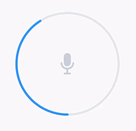

# CircularProgressView 如果好用给个 Star ！

#### UI 给了这样的需求，也找了一些库但都不太符合，索性自己写了一个！

<div style="display: flex; justify-content: space-between;">
   
</div>

## 如何使用

### 1. 声明

```swift
@IBOutlet var progressView: CircularProgressView!

或

var progressView: CircularProgressView!
progressView = CircularProgressView()
```

### 2. 调参

```swift
progressView.progress = 0.0 // 进度
progressView.lineWidth = 5 // 线宽
progressView.currentColor = rgba(47, 145, 255, 1) // 进度条颜色
progressView.progressBgColor = rgba(231, 234, 238, 1) // 背景颜色
```

### 3. 调用

```swift
progressView.progress = 0.5
```

## 如有问题或疑问，请通过电子邮件或 QQ 联系我！

##### If you have any questions or concerns, please contact me via email or QQ!

E-mail：matsonga@163.com
QQ：937496430
